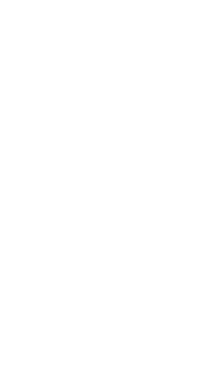

# Portfolio Web | Portfolio Website

### Español

Este es la web personal de Manuel Luna Alarcón, desarrollado como una página web responsiva para mostrar su perfil profesional. El sitio incluye información sobre formación académica, experiencia, conocimientos técnicos, proyectos realizados y formas de contacto.

El diseño se adapta a distintos tamaños de pantalla (ordenador, tablet y móvil) y permite alternar entre modo claro y oscuro mediante un botón visible en la parte superior.

Este proyecto ha sido desarrollado con HTML, CSS y JavaScript puro, y está publicado gratuitamente a través de GitHub Pages.

### English

This is the personal portfolio of [Your Name], developed as a responsive website to showcase their professional profile. The site includes information about academic background, experience, technical skills, completed projects, and contact details.

The design adapts to different screen sizes (desktop, tablet, and mobile) and allows switching between light and dark mode via a visible button at the top.

This project was developed using pure HTML, CSS, and JavaScript, and is freely published via GitHub Pages.

---

## Funcionalidades | Features

### Español

- Diseño totalmente responsivo  
- Alternancia entre modo claro y oscuro  
- Secciones informativas: inicio, conocimientos, proyectos, sobre mí y contacto  
- Publicación online mediante GitHub Pages

### English

- Fully responsive design  
- Toggle between light and dark mode  
- Informative sections: home, skills, projects, about me, and contact  
- Online publication via GitHub Pages

---

  
  Creado por Manuel Luna Alarcón

